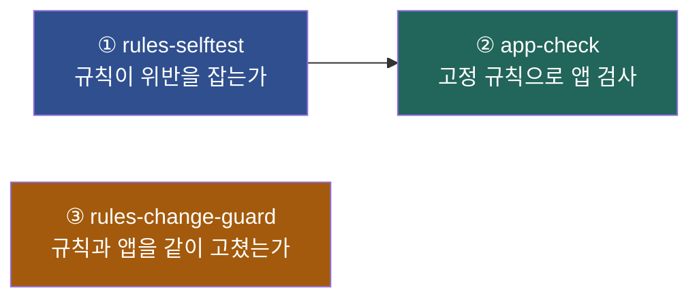

# CI 파이프라인 — 왜 워커를 나눴나

## 문제

규칙과 앱이 같은 빌드에 있으면 **위반에 걸린 사람이 규칙을 고쳐버릴 수 있다.**
그러면 가드레일이 아니다.

그리고 ArchUnit 규칙은 **통과만 하면 죽어 있어도 모른다.**
조건을 빈 값으로 바꿔놔도 앱 검사는 초록불이다.

## 세 워커



| 워커 | 하는 일 | 실패 조건 |
|---|---|---|
| **① rules-selftest** | 규칙을 위반 fixture 에 걸어 **반드시 실패하는지** 확인 | 규칙이 죽었거나, 규칙에 대응하는 fixture 가 없다 |
| **② app-check** | 고정된 규칙으로 앱을 검사 | 앱이 규칙을 어겼거나, 규칙이 멀쩡한 코드를 잡는다(오탐) |
| **③ rules-change-guard** | 한 PR 이 `guardrails/` 와 `sample/` 을 **동시에** 고쳤는지 | 동시에 고쳤다 — 사람이 봐야 한다 |

**②는 ①이 통과해야 돈다**(`needs`). 규칙이 죽은 채로 앱을 검사하는 것은 무의미하다.

## ③이 막는 것

```
규칙에 걸렸다  →  규칙을 느슨하게 고친다  →  초록불  →  merge
```

이 경로를 막는다. **규칙에 걸려서 규칙을 고치는 것**과 **규칙을 개선하는 것**은 다르다.
후자라면 PR 을 나누면 된다. 나누는 순간 리뷰어가 규칙 변경만 따로 보게 된다.

`CODEOWNERS` 로 `guardrails/` 변경에 승인을 걸어 한 겹 더 둔다.

## 저장소 분리 (다음 단계)

지금은 한 저장소의 멀티모듈이라 ③이 **관례적 차단**이다.
규칙을 별도 저장소로 빼고 앱이 **배포된 버전**을 의존하면 물리적으로 막힌다.

```
guardrails/          독립 저장소 · 버전 태그로 배포
   ↓ (고정 버전 의존)
app repos/           규칙을 고칠 방법이 없다
```

멀티모듈로 시작한 이유는 규칙과 fixture 를 같이 짜야 반복이 빨라서다.
규칙이 안정되면 분리한다.

## 증거 (B-M5) — 측정 완료

merge 가 실제로 막히는지는 **한 쌍**이어야 한다. 빨간불만 있으면
*"원래 안 되는 것 아니냐"* 가 된다. 같은 PR(#1), 같은 브랜치(`demo/violation`),
**커밋 하나 차이**로 확인했다.

| | 커밋 | 앱 검사 | `mergeStateStatus` | 실행 |
|---|---|---|---|---|
| 1 | `4d03867` 트랜잭션 안 외부 호출 | **FAILURE** | **BLOCKED** | [run 33655737527](https://github.com/Elian-bang/backend-guardrails/actions/runs/33655737527) |
| 2 | `b8d5af8` 외부 호출 제거 | SUCCESS | **CLEAN** | [run 33656299608](https://github.com/Elian-bang/backend-guardrails/actions/runs/33656299608) |

빨간불에서 CI 가 출력한 문장은 이렇다.

```
Rule 'methods that are annotated with @Transactional should not call 외부 시스템 호출,
because 외부 호출은 응답 시간이 통제 밖이라, 그동안 락과 커넥션을 붙잡는다' was violated (1 times):

dev.elian.mono.booking.service.BookingFacade.book(...) 이(가)
트랜잭션 안에서 org.springframework.web.client.RestTemplate.getForObject 를 호출한다 (외부 시스템 호출)
```

어느 파일 · 어느 메서드 · **왜 안 되는지**가 한 줄에 같이 나온다.
리뷰어가 댓글로 적어야 했던 문장을 CI 가 대신 적는다.

### 빨간불에서도 ①이 초록이었다는 점

| 워커 | 1번(위반) | 2번(제거) |
|---|---|---|
| 규칙 자체 검사 | SUCCESS | SUCCESS |
| 규칙 변경 감시 | SUCCESS | SUCCESS |
| 앱 검사 | **FAILURE** | SUCCESS |

**규칙이 죽어서 난 실패가 아니라 진짜 위반**이라는 뜻이다.
①이 같이 빨간불이었다면 규칙 자체를 의심해야 했다.

### 우회 차단

```
enforce_admins: true
required_status_checks.strict: true
contexts: [규칙 자체 검사, 앱 검사 (sample/monolith), 규칙 변경 감시]
```

저장소 소유자도 우회할 수 없다. `enforce_admins` 가 꺼져 있으면
"관리자는 그냥 머지하면 되는 것 아니냐" 로 증거가 무너진다.
