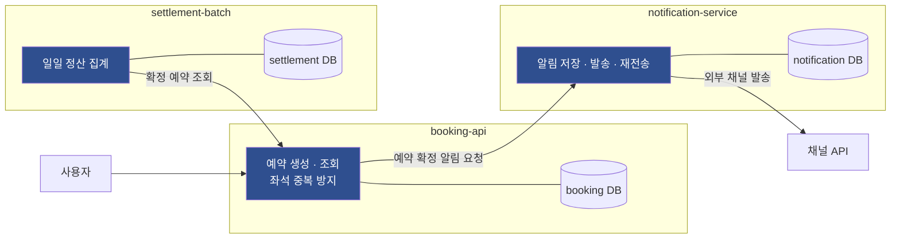

# 검증 대상 — 좌석 예약 서비스

규칙을 걸어볼 **하나의 서비스**를 세 개로 나눈다.
합성 fixture 만으로는 **자기 채점**이라, 돌아가는 앱에 규칙을 거는 편이 강하다.



**DB 를 서비스마다 나눈다.** 공유 DB 로 두면 서비스 간 호출이 사라지고,
그러면 R3·R8·R10 을 자극할 상황이 안 생긴다.

---

## 흐름

1. 사용자가 좌석을 예약한다 → `booking-api` 가 예약을 저장한다
2. 예약이 확정되면 `notification-service` 에 발송을 요청한다 (HTTP)
3. `notification-service` 가 알림을 저장하고 외부 채널로 발송한다 (실패 시 재전송)
4. 매일 `settlement-batch` 가 `booking-api` 에서 확정 예약을 조회해 정산한다

---

## 서비스별로 자극되는 규칙

### booking-api — 계층과 트랜잭션 경계

| 규칙 | 이 서비스에서 어떻게 나오나 |
|---|---|
| R1 Controller `@Transactional` 금지 | 예약 생성 API 에 트랜잭션을 붙이고 싶은 유혹 |
| R2 조회 `readOnly` | 예약 조회 · 좌석 목록 조회 |
| R4 `@Transactional` public 만 | 내부 헬퍼에 붙이는 실수 |
| R5 self-invocation | 같은 서비스 클래스 안에서 저장 메서드 호출 |
| R6 Repository 계층 | Controller 가 Repository 를 직접 부르는 실수 |
| **R3 트랜잭션 안 외부 호출** | **예약 저장 트랜잭션 안에서 알림 서비스를 부르는 실수** |
| **R10 커밋 후 발송** | 예약이 롤백돼도 알림은 나가는 문제 |

> **좌석 중복 예약 방지**가 자연스럽게 락 얘기를 만든다.
> 같은 좌석에 동시 요청이 들어오면 무엇으로 막을 것인가.

### notification-service — 외부 호출과 대기

| 규칙 | 이 서비스에서 어떻게 나오나 |
|---|---|
| **R3 트랜잭션 안 외부 호출** | 알림 저장과 채널 발송이 한 트랜잭션에 들어가는 실수 |
| **R7 트랜잭션 안 블로킹 대기** | 재전송 백오프를 트랜잭션 안에서 `sleep` |
| **R10 커밋 후 발송** | 발송이 커밋보다 먼저 나가는 실수 |
| R2 조회 `readOnly` | 발송 이력 조회 |

### settlement-batch — 대량 반복과 락

| 규칙 | 이 서비스에서 어떻게 나오나 |
|---|---|
| **R8 반복문 안 단건 조회** | 예약 1건씩 `booking-api` 를 호출 (서비스 간 N+1) |
| **R9 락을 잡는 쓰기 + 무거운 작업** | 정산 상태 갱신을 집계 전체와 한 트랜잭션에 |
| Query Count (B-M4) | 집계 쿼리 수가 건수에 비례하는지 |
| R7 블로킹 대기 | 외부 조회 대기가 트랜잭션 안에 |

---

## 검증 방식 — 앱 본체가 곧 `good` fixture

```
sample/<서비스>/
├── src/main/java/          ← 규칙을 지킨 코드. 오탐 검증용 (통과해야 한다)
└── src/test/java/
    ├── violations/         ← 고의 위반. 탐지 검증용 (실패해야 한다)
    └── GuardrailTest.java  ← 규칙 적용
```

합성 fixture 와 다른 점은 **`good` 쪽이 실제로 돌아가는 코드**라는 것이다.
규칙이 멀쩡한 코드를 잡으면 그 자리에서 드러난다.

---

## 워커 분리

규칙과 앱이 같은 빌드에 있으면 **위반에 걸린 사람이 규칙을 고쳐버릴 수 있다.**

| job | 하는 일 | 규칙을 고칠 수 있나 |
|---|---|---|
| `rules-selftest` | 규칙이 위반 fixture 에서 **실제로 실패하는지** 확인 | — 규칙 자체를 테스트 |
| `app-check` | **고정 버전** 규칙으로 앱을 검사 | ❌ 의존성으로 가져다 쓸 뿐 |

`rules-selftest` 가 없으면 규칙이 죽어도 모른다.
조건을 빈 값으로 바꿔놔도 `app-check` 는 초록불이다.
